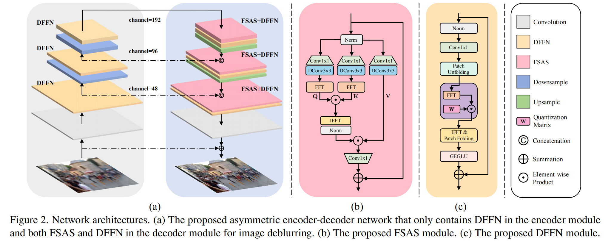

# Effcient Frequence Domain-based Transformer for High-Quality Image Deblurring - Official Pytorch Implementation

<p align="center">


This repository provides the official PyTorch implementation of the following paper:

> Effcient Frequence Domain-based Transformer for High-Quality Image Deblurring
>
> Lingshun Kong, Jiangxin Dong, Jianjun Ge, Mingqiang Li, Jinshan Pan
>
> In CVPR 2023. 
>
> Paper: https://openaccess.thecvf.com/content/CVPR2023/papers/Kong_Efficient_Frequency_Domain-Based_Transformers_for_High-Quality_Image_Deblurring_CVPR_2023_paper.pdf
>
> Abstract: We present an effective and efficient method that explores the properties of Transformers in the frequency domain for high-quality image deblurring. Our method is motivated by the convolution theorem that the correlation or convolution of two signals in the spatial domain is equivalent to an element-wise product of them in the frequency domain. This inspires us to develop an efficient frequency domain based self-attention solver (FSAS) to estimate the scaled dot-product attention by an element-wise product operation instead of the matrix multiplication in the spatial domain. In addition, we note that simply using the naive feed-forward network (FFN) in Transformers does not generate good deblurred results. To overcome this problem, we propose a simple yet effective discriminative frequency domain-based FFN (DFFN), where we introduce a gated mechanism in the FFN based on the Joint Photographic Experts Group(JPEG) compression algorithm to discriminatively determine which low- and high-frequency information of the features should be preserved for latent clear image restoration. We formulate the proposed FSAS and DFFN into an asymmetrical network based on an encoder and decoder architecture, where the FSAS is only used in the decoder module for better image deblurring. Experimental results show that the proposed method performs favorably against the state-of-the-art approaches.

---

## Contents

The contents of this repository are as follows:

1. [Dependencies](#Dependencies)
2. [Train](#Train)
3. [Test](#Test)


---

## Dependencies

- Python
- Pytorch (1.11)
- scikit-image
- opencv-python
- Tensorboard
- einops

---


---

## Train

bash train.sh

---

## Test

Realblur pre-trained model is available at https://drive.google.com/drive/folders/1l_R8_2UKfiQP_BYrgcQrmCBSe_ogwL41?usp=drive_link

bash test.sh

Output images will be saved in ``` results/model_name/dataset_name/``` folder.

We measured PSNR using [official RealBlur test code](https://github.com/rimchang/RealBlur#evaluation). You can get the PSNR we achieved by cloning and following the RealBlur repository.

---

## Acknowledgment: 
This code is based on the [Restormer](https://github.com/swz30/Restormer) and [NAFNet](https://github.com/megvii-research/NAFNet)

